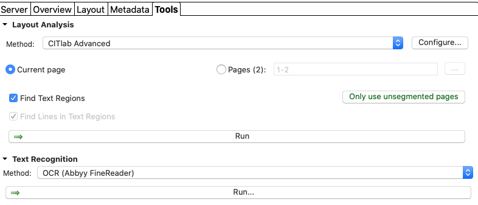

During this session, we will perform a transcription of a couple of pages of a theater play. This means extracting the text out of a digital image.

## Download the image to transcribe

Create a directory on your local computer where you will download a couple of images from a [document](https://gallica.bnf.fr/ark:/12148/bpt6k3209399/) in Gallica.

## Use Transkribus to perform the transcription

You need to create an account on [Transkribus](https://transkribus.eu). You will then be able to download and install the desktop application. (See the [Wiki](https://transkribus.eu/wiki/index.php/Main_Page) for additional help)

Once logged-in in the application, you can upload your directory of images into Transkribus using the "Import documents" button from the toolbar.

The documents will be added to your current collection (you can create another collection if desired).

From the "Tool" tab, you can then run the layout analysis and the text recognition.

**What can you observe?**

(Also try different layout analysis algorithms, recognition algorithms, or languages.)

Finally, from the top left "hamburger menu", you can export the output with the "Document => Export Document" option. You can use the "Client export".

**What are the formats available?**

## Inspect the output 

Unless you already have a favorite text and XML editor, we recommend to download [VSCode](https://code.visualstudio.com/). For XML viewing / editing, we also recommend to install the [XML Tools](https://marketplace.visualstudio.com/items?itemName=DotJoshJohnson.xml) extension.

**What can you observe in the various text files?**

(Compare with existing transcriptions. e.g. in [ark:/12148/bpt6k56792582](https://gallica.bnf.fr/ark:/12148/bpt6k56792582))

