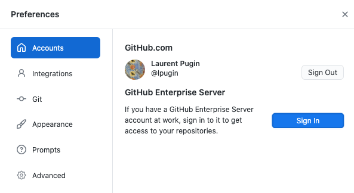
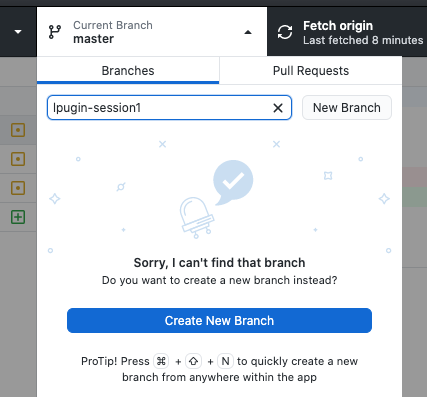
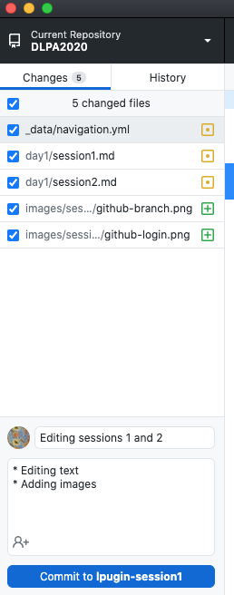
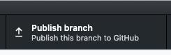

In this session, we will connect to GitHub in order to make modifications to this website. Once the required setup will be in place, you will be able to publish content to the website and to populate it throughout the upcoming sessions. It will then act as a workspace to publish the output of the seminar.

## Connection to GitHub

For this session, you need to download and install [GitHub Desktop](https://desktop.github.com/) - unless you already have another Git client installed or prefer to use the command line. You also need to create an account on [GitHub](https://github.com).

From the GitHub Desktop application, you should be able to login with your GitHub account. 



You can then clone the [course repository](https://github.com/dhbern/dlpa2020) into your local machine. 

Try then to create a new branch in which you will be doing some modifications (choose a personal name). 



Once your modifications are done (changing a file, adding a file, etc.) you can then stage and commit them. 



Finally, you can push your commits to the GitHub server with they can be merged to the master branch once approved.



## Changes to the website

Try to add a page to the website by adding a Markdown (.md) file in the `./day1` directory. Pages need to start with a front matter
```md
---
layout: single
title: Title-of-your-page
---
```

The [Markdown-Cheatsheet](https://github.com/adam-p/markdown-here/wiki/Markdown-Cheatsheet) will help you to format your document.

Try to:
* Add the image you downloaded for the recognition (place the image in `./images/output/`)
* Add a transcription text with code blocks ```` ``` text ``` ````