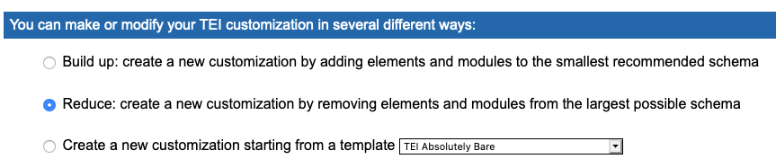
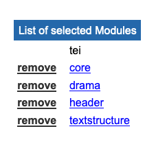
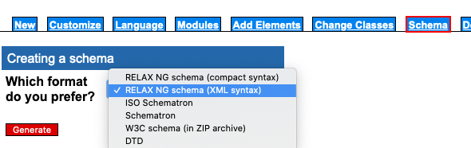
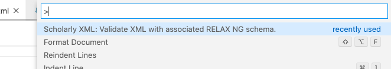

In this session, we will experiment with TEI encoding with a focus on drama features.

## Customization of the TEI Schema

In order to facilitate the understanding of the TEI Schema, we will produce a basic TEI customization that reduces the number of tags defined in the Schema.

The customization will be generated with [Roma](https://roma.tei-c.org/startroma.php) and you will have to go through the following steps.

First select "Reduce" as the type of customization.



Then in the "Module" tab, add or remove the modules in order to keep only `core`, `drama`, `header` and `textstructure`.



Finally, generate the Schema from the "Schema" tab selecting "Relax NG schema (XML Syntax)".



Save the schema a subdirectory (personal name) of `./tei`

## Text encoding

We will now start to edit a TEI file. Place it in the same directory as the Schema generated above. You can use the TEI output from Transkribus (otherwise there is a `TEI-template.xml` file in `./tei`).

In order to be able to validate the file while editing, we should install the [Scholarly XML](https://marketplace.visualstudio.com/items?itemName=raffazizzi.sxml) extension and the additional ones recommended by it - see at the bottom of the page.

The TEI file needs to refer to the Schema for validation. This means adding before the root `<TEI>` tag the following instruction - with the appropriate Schema filename:
```xml
<?xml-model href="tei_drama.rng" schematypens="http://relaxng.org/ns/structure/1.0" type="application/xml"?>
```

Once this is place, you should be able to validate your file with the palette raised  with `Command-Shift-P` (Mac) or `Ctrl-Shift-P` (Windows) and the "Scholarly XML: Validate XML with associated RELAX NG Schema" command.



You can now edit the content of the file. Some help:
* [TEI Guidelines / Performance Texts](https://www.tei-c.org/release/doc/tei-p5-doc/en/html/DR.html)
* [TEI By Example / Drama](https://teibyexample.org/tutorials/TBED05v00.htm)

You can try to:
* Encode the global structure of the excerpt within the `<body>`
```xml
<div type="act">
    <head>ACT PREMIER</head>
    <div type="scene">
        <head>SCENE PREMIERE</head>
        <!-- ... -->
    </div>
</div>
```
* Markup a speech lines with the speaker and their texts (note the escaped `&` as `&amp;`)
```xml
<sp>
    <speaker>MAISTRE DE MUSIQUE </speaker>
    <p>Venez, entrez dans cette Salle, &amp; vous reposez-là, en attendant qu'il vienne</p>
</sp>
```

* Add a cast list in the front matter
```xml
<castItem xml:id="jourdain">
    <role>MONSIEUR JOURDAIN</role>
    <roleDesc>Bourgeois</roleDesc>
</castItem>
```

* Make the speaker refer to items in the cast list
```xml
<sp who="#jourdain">
```

* Add stage directions with the `<stage>` element

## Publication

For the publication, we use [CETEIcean](https://github.com/TEIC/CETEIcean) that is already loaded in the website structure. To run it, we need a to use another front matter than for the other pages. It needs to be
```md
---
layout: tei
title: Title-of-your-page
teiFile: "your-directory/your-TEI-file.xml"
---

```

Any Markdown code in the file will be displayed before the TEI content.
